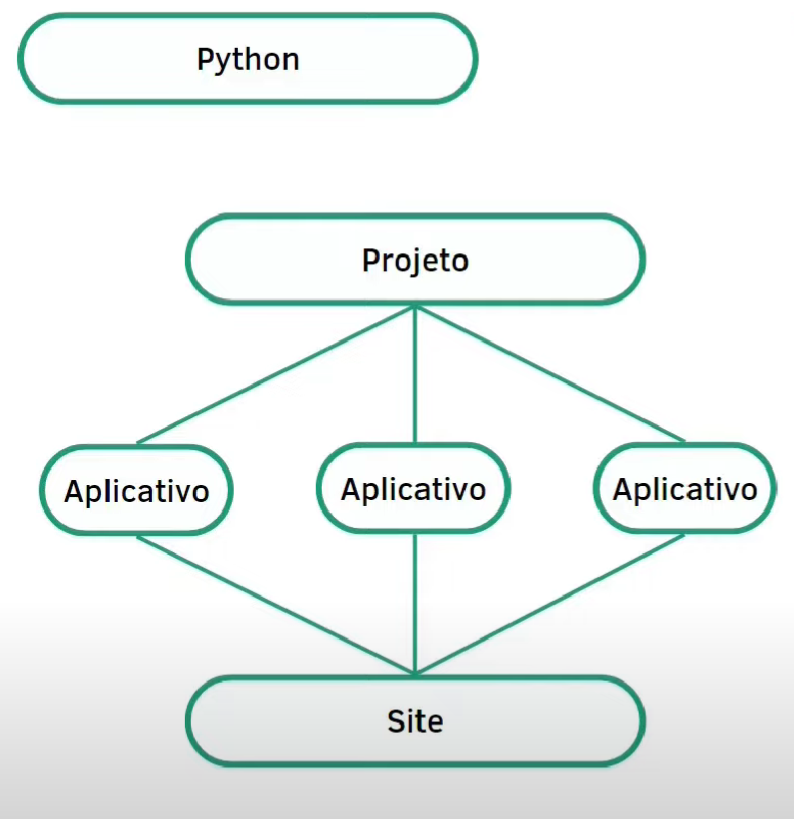
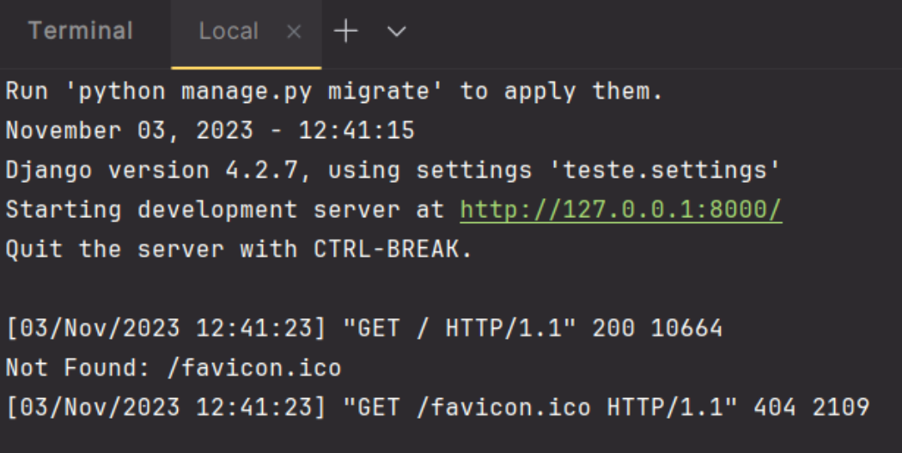
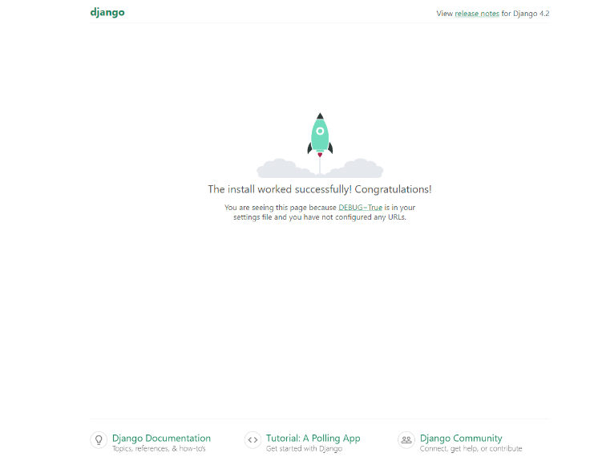
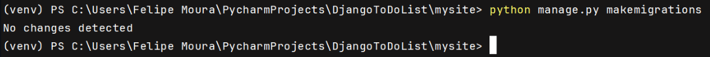

# Django Guide

In this file, I'll be writing all the steps I used to set up the settings of this project.

## Django Map

Before we dive into coding, it's crucial to grasp how Django operates.

First and foremost, when you say "I'll use Django", you're essentially saying that you're going to work with Python. So, if you already have a grasp of Python's fundamentals, including data structures and flow control, you're off to a great start.

To initialize your coding you're going to create a project with Django, inside this project you create an APP, and based on this app you create your website.

P.S: A website can have more than one App!



### Project Details

When you create a project with Django same default structures will be generated, inside this basic structure, there is a file named `settings.py`. When we edit this file we are editing your project settings. In there, we can change database configs, language configs, etc...

After generating the basic structure, we need to create an APP, but to associate the APP to the project we use `settings.py`.

### App Details

Creating an APP will generate a folder with the name you provided for the APP. Inside this folder, there are some files:

- `views.py`, which is responsible for all the logic of what will be displayed to the user.
- `urls.py`, which is responsible for creating the application's URLs.

`views.py` and `urls.py` are related and `<app name>/urls.py` is related with `<project name>/urls.py`. Exemplo below:


***P.S:** To connect with the front-end, in `views.py`, we can add `.html` files that are linked to your system's logic.*

### Database

As I said earlier, at `setting.py` we can configure your database and, by doing this, we upgrade your website to something that can save, delete, show, and update data.


Once you've integrated your application with a database, we need to update `models.py` this file helps us to communicate with your database, without using SQL, just by using Python.

It's only possible because Django has an API that interacts with database for us.

### The End

Finally, to conclude your map, we need to talk about the "Admin Interface", this interface helps the admin of your site to add data, and update stuff in there. This is important because not always the admin is a programmer, so it is easier to administrate the application.


So let's take a look at the full map of your project:


## Starting the environment

After installing Django using `pip install django`. It's necessary to start a project WITH Django by inserting in the terminal the command below:

**Make sure you are in the same directory where you've installed Django**.

```terminal
django-admin startproject <project name>
```

The `<project name>` doesn't matter at all so you can put whatever you want.

After running the command, a folder will appear that will have the same name you have used at the command above.

You'll see that in this folder exists a package and a file called `manage.py`. This file is the heart of your application, every time you need to execute it you call `manage.py`.

But we don't need to execute it by now. First of all, start an app, it'll be one page of your web application. You can do this by writing in the terminal this command:

`python manage.py startapp <application name>`

_This application name will be shown in the navigation bar of your browser after the domain_

Now to register this app go to `settings.py` and at the list INSTALLED_APPS insert the app name, to run it later.

```python
INSTALLED_APPS = [
    'django.contrib.admin',
    'django.contrib.auth',
    'django.contrib.contenttypes',
    'django.contrib.sessions',
    'django.contrib.messages',
    'django.contrib.staticfiles',
    '<APP NAME>',
]
```

After all this stuff, in order to test if your application is OK, execute this terminal command:

`python manage.py runserver`

If everything is OK the page below will appear to you:



Click (or copy) the localhost and you will see the site below:



If there is a rocket there, it's everything correct with your application.

## Integrating with Database

After you have tested if everything is OK it's time to integrate your database, by default the database Django uses is SQLite, as you can see in the folder created by `django-admin startproject <project name>`, there is a _db.sqlite3_ file.

If you don't want to use SQLite database is possible to change it by going to the **projects package**, accessing settings.py, and altering _the DATABASE_ dictionary that is in there. Example below:

```python
# Approximately in line 76
DATABASES = {
    'default': {
        'ENGINE': 'django.db.backends.sqlite3',
        'NAME': BASE_DIR / 'db.sqlite3',
    }
}
```

### Postgres Database

If you want to use Postgres Database, it's required to install psycopg2 library.

```terminal
pip install psycopg2
```

#### Editing DATABASE dictionary

Intending to use Postgres database, replace that default dictionary DATABASES to:

```python
DATABASES = {
    'default': {
        'ENGINE': 'django.db.backends.postgresql_psycopg2',
        'NAME': '[DATABASE NAME]',
        'USER': '[DATABASE USER]',
        'PASSWORD': '[USER PASSWORD]',
        'HOST': '[DATABASE HOST]', # While developing, use localhost or 127.0.0.1
        'PORT': '[DATABASE PORT]', # Postgres default is 5432
    }
}
```

Replace the words that are in [ ] as you need.

<strong>Remember</strong>: Don’t keep sensitive data in the setting file, instead, create a .json file, and in there write your data.

(Don't forget to add it at `.gitignore` file)

#### Protecting Data

.json file should have the format below, make sure this .json is in the same directory as settings.py:

```json
{
  "SECRET_KEY": "ADD YOUR SECRET KEY HERE", // Approximately in line 28 at settings.py
  "DB_NAME": " ",
  "DB_USER": " ",
  "DB_PASSWORD": " ",
  "DB_HOST": " ",
  "DB_PORT": " "
}
```

Now that .json file is configured it's time to import json library at settings.py and read the file:

```python
# At settings.py
import json

# Reading the supersecret.json
with open("supersecret.json") as json_file:
    config = json.load(json_file)

...

# Replacing sensitive data (SECRET_KEY & DATABASE)
SECRET_KEY = config['SECRET_KEY']

...

DATABASES = {
    'default': {
        'ENGINE': 'django.db.backends.postgresql_psycopg2',
        'NAME': config['DB_NAME'],
        'USER': config['DB_USER'],
        'PASSWORD': config['DB_PASSWORD'],
        'HOST': config['DB_HOST'],
        'PORT': config['DB_PORT'],
    }
}
```

#### Updating Database

After configuring DB, we need to update it with the latest data from our project, because after creating the database it's empty. So to charge data to it we write this command in the terminal:

```terminal
python manage.py makemigrations
```

**MAKEMIGRATIONS** is a command that updates our database models we need to run this every time models.py is changed.



If you got that response above, know that it's an error but it's a good error, it tells us that all modules are installed correctly and the database is connected.

The next command, after makemigrations is `migrate`.

```
python manage.py migrate
```

**MIGRATE** is a command that submits our table to the database server.

🧐❗💥💥TO BE CONTINUED💥💥❗🧐
